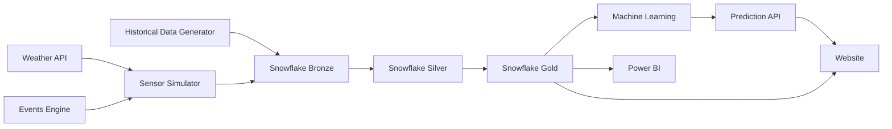
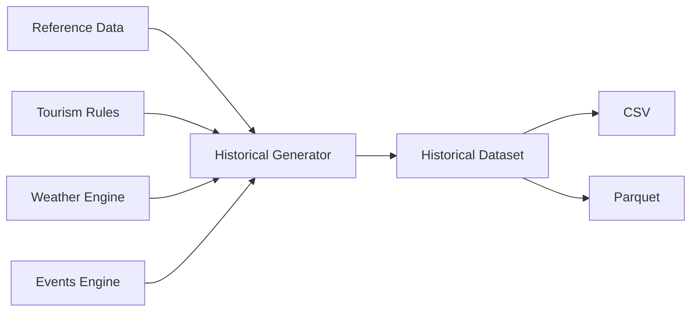

<div align="center">

# 🏛️ Spirit of Ankh

### Smart Tourism Intelligence Platform for Egypt

Modern Data Engineering • Machine Learning • Real-Time Analytics • Snowflake • Airflow • Azure

---

<!-- Banner will be added here -->

<!-- Badges -->


</div>

---

# 🌍 Project Overview

Spirit of Ankh is a modern data engineering platform designed to monitor, analyze, and predict tourism crowd dynamics across Egypt's major tourist attractions.

The platform integrates historical data generation, real-time sensor simulation, cloud data warehousing, machine learning, and interactive analytics into a unified ecosystem that supports smarter tourism management and data-driven decision making.

Unlike traditional crowd monitoring systems that depend on expensive IoT infrastructure, Spirit of Ankh leverages realistic simulation, cloud-native technologies, and predictive analytics to deliver a scalable and cost-effective solution.

---

# 🚀 Repository Highlights

- 🇪🇬 Covers Egypt's major tourist attractions
- 🏛️ Supports **45 tourist locations**
- 📅 Generates **3 years of historical tourism data (2023–2025)**
- 📊 Produces over **580,000 realistic historical records**
- 📡 Real-Time Sensor Simulation
- ☁️ Modern ELT Data Pipeline
- ❄️ Snowflake Data Warehouse
- 🔄 Apache Airflow Automation
- 🤖 Machine Learning Crowd Prediction
- 📈 Power BI Interactive Dashboards
- 🌐 Web-based Tourism Intelligence Platform

---

# 🎯 Project Objectives

The project aims to build a scalable tourism intelligence platform capable of:

- Monitoring crowd levels across tourist attractions
- Simulating real-time tourism activity
- Generating realistic historical datasets
- Automating ELT data pipelines
- Building an enterprise-grade data warehouse
- Predicting future crowd occupancy using Machine Learning
- Providing actionable insights through interactive dashboards
- Supporting tourism authorities in data-driven decision making

---

# ✨ Key Features

## 📊 Historical Data Generation

Generate realistic tourism datasets covering multiple years using custom simulation engines.

---

## 📡 Real-Time Sensor Simulation

Simulate live visitor activity using weather-aware and event-aware crowd generation.

---

## ☁️ Modern ELT Pipeline

Automated ingestion, transformation, and modeling powered by Snowflake and SQL.

---

## 🧠 Tourism Intelligence KPIs

Custom tourism analytics including:

- Crowd Persistence Index (CPI)
- Crowd Status
- Hidden Gems
- Weather Impact
- Holiday Impact
- Resource Utilization

---

## 🤖 Machine Learning

Predict future crowd occupancy using a Random Forest regression model.

---

## 📈 Interactive Dashboards

Business-ready dashboards providing real-time operational insights.

---

# 🏗️ Overall System Architecture



---

# 🛠️ Technology Stack

| Category | Technologies |
|-----------|--------------|
| Programming | Python |
| Cloud | Microsoft Azure |
| Data Warehouse | Snowflake |
| Data Transformation | SQL |
| Orchestration | Apache Airflow |
| Machine Learning | Scikit-Learn |
| Data Processing | Pandas, NumPy |
| Dashboard | Power BI |
| Containerization | Docker |
| API | Flask |
| Version Control | Git & GitHub |

---

# 📁 Repository Structure

```text
Spirit_of_Ankh

├── airflow-docker/
├── data/
│   ├── historical/
│   └── reference-data/
│
├── data-generation/
├── data-warehouse/
│   ├── bronze/
│   ├── silver/
│   └── gold/
│
├── docs/
├── machine-learning/
├── sensor-simulator/
│
├── README.md
├── config.py
├── .gitignore
└── .env.example
```

---

# 📦 Project Modules

The platform consists of five major modules:

| Module | Description |
|---------|-------------|
| Data Generation | Generates realistic historical tourism datasets |
| Sensor Simulator | Simulates real-time visitor activity |
| Data Warehouse | Snowflake Bronze, Silver and Gold architecture |
| Machine Learning | Predicts future crowd occupancy |
| Airflow | Automates the entire data pipeline |

--- 
# 📊 Historical Data Generation

The Historical Data Generation module creates realistic tourism datasets covering three consecutive years (2023–2025). Since no public historical tourism dataset exists for Egyptian attractions with the required level of detail, this module was developed to simulate realistic visitor behavior based on tourism seasons, holidays, weather conditions, attraction popularity, and special events.

The generated dataset serves as the primary historical data source for analytics, machine learning, and dashboarding.

---

## 📌 Overview

This module produces hourly tourism records for all supported tourist attractions across Egypt.

Each generated record contains:

- Timestamp
- Tourist Attraction
- Visitor Count
- Occupancy Rate
- Weather Information
- Tourism Season
- Active Events
- Crowd KPIs
- Contextual Metadata

The final output contains over **580,000 realistic tourism records** spanning three years.

---

## ⚙️ Workflow



---

## 📁 Module Structure

```text
data-generation/

historical_generator.py

historical_generator_test.py

historical_rules.py

historical_events_engine.py

weather_engine.py

crowd_engine.py

event_engine.py
```

---

## 📥 Input

Reference Data

- Tourist Locations
- Holidays
- Tourism Events

Simulation Parameters

- Tourism Seasons
- Weather Conditions
- Attraction Popularity
- School Vacations
- Islamic Holidays
- National Events

---

## 📤 Output

Generated Files

```text
data/

historical/

historical_2023.csv

historical_2024.csv

historical_2025.csv

historical_2023.parquet

historical_2024.parquet

historical_2025.parquet
```

---

## 📈 Generated Metrics

The generator calculates multiple tourism indicators:

- Visitor Count
- Occupancy Rate
- Crowd Status
- CPI
- Weather Impact
- Holiday Impact
- Event Impact
- Tourism Season
- Resource Utilization

---

## 🧠 Business Logic

Tourism demand is influenced by several factors:

- Attraction popularity
- City tourism season
- Active events
- Public holidays
- School vacations
- Weekend multiplier
- Weather conditions

These variables are combined to produce realistic crowd behavior rather than purely random values.

---

## 🏆 Key Features

- Hourly simulation
- Multi-year generation
- Event-aware
- Weather-aware
- Season-aware
- City-specific tourism patterns
- Islamic holiday support
- CSV and Parquet export

---

## 🚀 Why This Module?

The lack of publicly available historical tourism datasets for Egypt makes it difficult to develop analytics and machine learning solutions.

This module eliminates that limitation by generating realistic, scalable, and reproducible tourism datasets suitable for data engineering pipelines, business intelligence, and predictive analytics.
