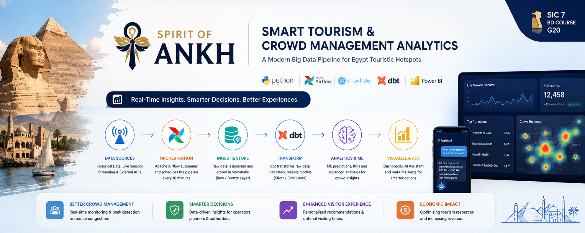
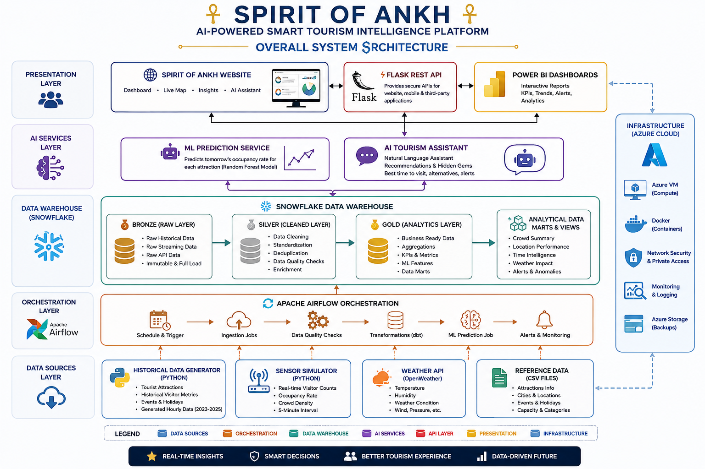
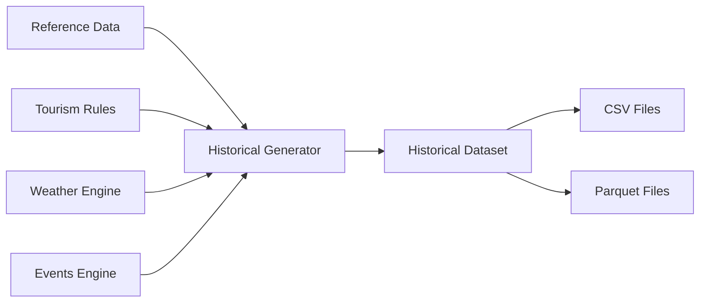
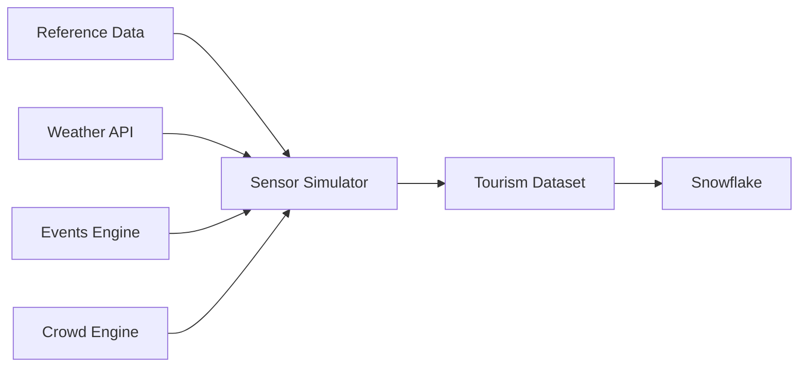
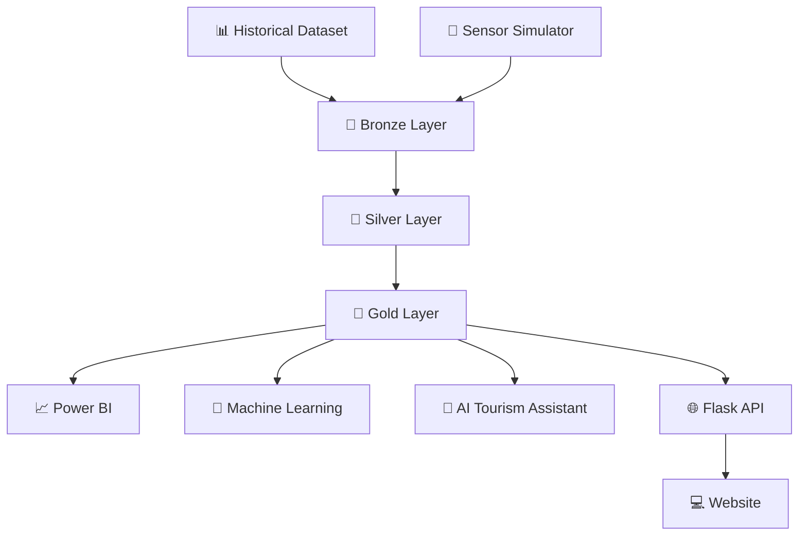
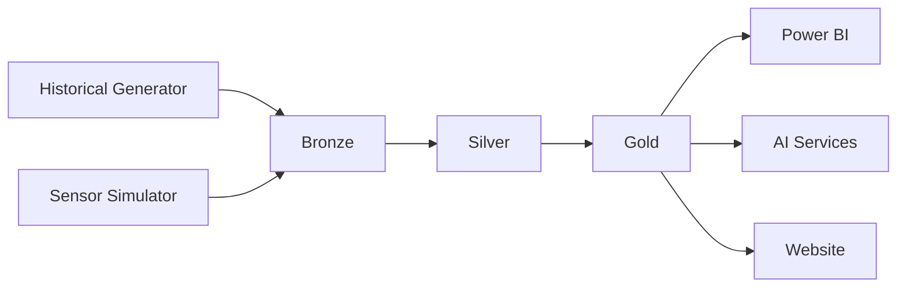
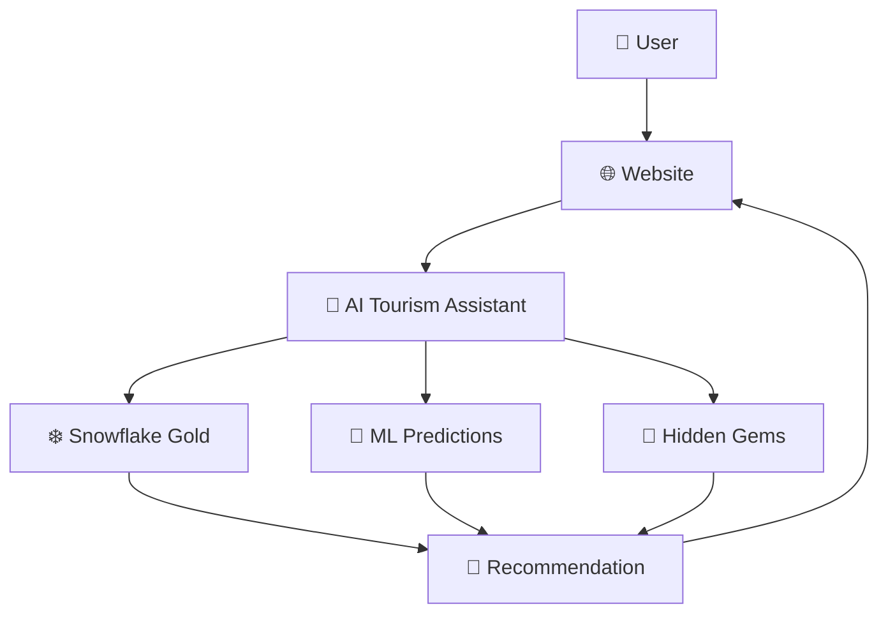

<div align="center">

# 🏛️ Spirit of Ankh

### AI-Powered Smart Tourism Intelligence Platform for Egypt

<p align="center">
Modern Data Engineering • Artificial Intelligence • Machine Learning • Real-Time Analytics
</p>

---
<!-- ================= Banner ================= -->

<p align="center">
  
</p>

---

<!-- ================= Badges ================= -->


</div>

---

# 🌍 Overview

**Spirit of Ankh** is an AI-powered Smart Tourism Intelligence Platform designed to help tourism authorities and visitors make smarter decisions through real-time analytics, machine learning, and intelligent recommendations.

The platform combines historical data generation, live sensor simulation, cloud data engineering, predictive analytics, and AI-powered assistance into a unified ecosystem capable of monitoring, analyzing, and predicting tourism crowd behavior across Egypt's major tourist attractions.

Unlike traditional tourism monitoring systems that rely on expensive IoT infrastructure, Spirit of Ankh leverages realistic simulation, scalable cloud technologies, and artificial intelligence to provide a cost-effective and extensible solution.

---

# 🚀 Repository Highlights

- 🇪🇬 Covers Egypt's major tourist attractions
- 🏛️ 45 Tourist Locations
- 📅 Three Years of Historical Tourism Data (2023–2025)
- 📊 580K+ Realistic Historical Records
- 📡 Real-Time Sensor Simulation
- ☁️ Modern ELT Data Pipeline
- ❄️ Snowflake Data Warehouse
- 🔄 Apache Airflow Automation
- 🤖 Machine Learning Crowd Prediction
- 💬 AI Tourism Recommendation Assistant
- 📈 Power BI Dashboards
- 🌐 Interactive Web Platform

---

# 🚧 Problem Statement

Tourism is one of Egypt's most valuable economic sectors, attracting millions of visitors every year.

As visitor numbers continue to grow, managing crowd distribution across tourist attractions becomes increasingly challenging.

Current solutions typically depend on manual monitoring, ticketing systems, or costly IoT infrastructure, making them difficult to deploy at scale.

In addition, there is no publicly available historical tourism dataset for Egypt that supports advanced analytics or predictive modeling.

These challenges motivated the development of **Spirit of Ankh**, a platform that combines data engineering, artificial intelligence, and business analytics to create a modern tourism intelligence ecosystem.

---

# 🎯 Project Objectives

Spirit of Ankh aims to:

- Monitor tourism crowd levels in real time.
- Generate realistic historical tourism datasets.
- Build a scalable cloud-based data warehouse.
- Automate the ELT pipeline.
- Predict future crowd occupancy using Machine Learning.
- Recommend less crowded tourist attractions.
- Support data-driven tourism management.
- Improve visitor experience through AI recommendations.

---

# 📊 Business Impact

Spirit of Ankh transforms raw tourism data into actionable insights.

The platform helps tourism authorities:

- Detect overcrowding before it becomes critical.
- Improve visitor distribution.
- Reduce congestion.
- Optimize operational resources.
- Support strategic planning.
- Increase visitor satisfaction.

Visitors also benefit from personalized recommendations, allowing them to discover alternative attractions with lower crowd levels while maintaining a high-quality tourism experience.

---

# ✨ Core Features

| Feature | Description |
|----------|-------------|
| 📊 Historical Data Generation | Generates realistic multi-year tourism datasets |
| 📡 Real-Time Sensor Simulation | Simulates live tourism activity |
| ❄️ Snowflake Data Warehouse | Enterprise-grade analytical warehouse |
| 🔄 ELT Pipeline | Automated ingestion and transformation |
| 🤖 Crowd Prediction | Forecasts tomorrow's occupancy using Machine Learning |
| 💬 AI Tourism Assistant | Recommends alternative attractions based on crowd conditions |
| 💎 Hidden Gems Engine | Discovers less crowded tourist destinations |
| 📈 Power BI Dashboards | Interactive operational analytics |
| 🌐 Web Platform | User-friendly tourism intelligence website |

---

# 🧠 Artificial Intelligence

Spirit of Ankh integrates two complementary AI services.

## 🤖 Crowd Prediction Model

A Machine Learning model predicts future occupancy levels for each tourist attraction using historical data and contextual features.

Predictions include:

- Tomorrow's Occupancy Rate
- Expected Crowd Status
- Visitor Trends

These predictions support proactive tourism planning.

---

## 💬 AI Tourism Assistant

The AI Tourism Assistant goes beyond prediction.

It analyzes:

- Current crowd status
- Tomorrow's predictions
- Hidden Gems rankings
- Tourist preferences

and recommends alternative attractions whenever a selected location is expected to be overcrowded.

### Example

**User**

> I want to visit the Pyramids tomorrow.

**Assistant**

> The Pyramids are expected to experience very high occupancy between 1 PM and 3 PM.

> Recommended alternatives:

- Saqqara Necropolis
- Dahshur Pyramids
- National Museum of Egyptian Civilization

This transforms the platform from a prediction system into an intelligent tourism decision support platform.

---

# 🌐 Live Demo

🚧 Coming Soon

Website:
> (Will be added after deployment)

---

# 📸 Website Preview

Screenshots will be added after completing the web application.

- Home Page
- Dashboard
- Live Crowd Map
- Hidden Gems
- AI Assistant
- Predictions
- Location Details 

# 🏗️ Overall System Architecture

The Spirit of Ankh platform follows a modern cloud-native architecture that integrates data engineering, artificial intelligence, business intelligence, and web technologies into a unified tourism intelligence ecosystem.

## 🏛 Overall System Architecture

<p align="center">
  
</p>
```

---

# ⚙️ Technology Stack

| Layer | Technologies |
|--------|--------------|
| Programming Language | Python |
| Cloud Platform | Microsoft Azure |
| Data Warehouse | Snowflake |
| Data Processing | Pandas, NumPy |
| Machine Learning | Scikit-Learn |
| Workflow Orchestration | Apache Airflow |
| Containerization | Docker |
| REST API | Flask |
| Visualization | Power BI |
| Version Control | Git & GitHub |

---

# 📂 Repository Structure

```text
Spirit_of_Ankh/

│
├── airflow-docker/
│
├── data/
│   ├── historical/
│   └── reference-data/
│
├── data-generation/
│
├── data-warehouse/
│   ├── bronze/
│   ├── silver/
│   └── gold/
│
├── docs/
│
├── machine-learning/
│
├── sensor-simulator/
│
├── README.md
├── config.py
├── .env.example
└── .gitignore
```

---

# 📦 Project Modules

The platform is composed of five core modules that work together to provide an end-to-end smart tourism solution.

| Module | Responsibility |
|---------|----------------|
| Data Generation | Creates realistic historical tourism datasets |
| Sensor Simulator | Generates live tourism sensor data |
| Data Warehouse | Stores, transforms, and models data |
| AI Services | Crowd prediction and intelligent recommendations |
| Airflow | Automates the complete data pipeline |

---

# 📊 Historical Data Generation

## Overview

Because no detailed historical tourism dataset exists for Egyptian attractions, Spirit of Ankh includes a custom simulation engine capable of generating realistic tourism data covering three years (2023–2025).

The generated dataset serves as the foundation for analytics, machine learning, and business intelligence.

---

## Workflow



---

## Main Components

| Component | Responsibility |
|-----------|----------------|
| historical_generator.py | Main dataset generator |
| historical_rules.py | Tourism logic and multipliers |
| historical_events_engine.py | Holiday and event processing |
| weather_engine.py | Weather simulation |
| crowd_engine.py | Visitor generation engine |

---

## Generated Dataset

The historical generator produces:

- Hourly tourism records
- Occupancy rate
- Crowd status
- Tourism seasons
- Weather conditions
- Public holidays
- Islamic holidays
- Special events
- Crowd Persistence Index (CPI)

---

## Business Value

The generated historical dataset enables:

- Machine Learning training
- Dashboard development
- Time-series analysis
- Capacity planning
- Tourism trend analysis

without requiring access to unavailable real-world datasets.

---

# 📡 Real-Time Sensor Simulator

## Overview

The Sensor Simulator emulates a live smart tourism environment by generating realistic visitor activity every execution cycle.

Instead of relying on expensive physical sensors, the simulator combines weather conditions, active events, attraction popularity, and operational rules to estimate current visitor activity.

---

## Sensor Architecture



---

## Key Features

- Real-time visitor simulation
- Weather-aware generation
- Event-aware generation
- Crowd density estimation
- Satisfaction estimation
- Peak detection
- Resource utilization estimation

---

## Generated KPIs

Every execution cycle calculates:

- Visitor Count
- Occupancy Rate
- Crowd Status
- Resource Usage
- Satisfaction Score
- Weather Impact
- Event Impact
- Peak Flag

---

## Why Use a Simulator?

A real deployment would obtain data from:

- Smart Gates
- Ticketing Systems
- CCTV Analytics
- IoT Devices
- Wi-Fi Tracking

Since these sources are unavailable during development, the simulator generates realistic operational data while preserving the behavior expected in production.

---
# ❄️ Snowflake Data Warehouse

The Snowflake Data Warehouse is the analytical core of the Spirit of Ankh platform.

It follows the modern **Bronze → Silver → Gold** architecture to ensure scalable data processing, high data quality, and optimized analytical performance.

Historical datasets and real-time sensor data are consolidated into a unified analytical model that powers dashboards, machine learning models, APIs, and the AI Tourism Assistant.

---

# 🏛 Warehouse Architecture



---

# 🥉 Bronze Layer

The Bronze layer stores raw data exactly as received from different data sources.

No business transformations are applied at this stage.

### Responsibilities

- Raw historical data
- Raw sensor data
- Data preservation
- Auditability
- Data lineage

---

# 🥈 Silver Layer

The Silver layer cleans and validates the incoming data before it becomes available for analytics.

### Responsibilities

- Remove duplicates
- Handle missing values
- Validate timestamps
- Validate occupancy values
- Standardize weather categories
- Calculate derived metrics
- Normalize datasets

---

# 🥇 Gold Layer

The Gold layer contains business-ready datasets optimized for reporting and AI services.

### Main Tables

| Table | Purpose |
|---------|----------|
| DIM_LOCATION | Tourist attraction dimension |
| DIM_DATE | Calendar dimension |
| FCT_CROWD_UNIFIED | Historical + Live crowd data |
| FCT_CROWD_SUMMARY | Daily KPIs |
| LOCATION_QUALITY_SCORE | Hidden Gems ranking |
| ML_PREDICTIONS_NEXT_HOUR | ML output |
| ML_PREDICTIONS_TOMORROW | ML output |

---

# 📊 Analytical Views

The warehouse exposes optimized views for dashboards and APIs.

| View | Description |
|--------|-------------|
| VW_CURRENT_STATUS | Current crowd situation |
| VW_ACTIVE_ALERTS | Active overcrowding alerts |
| VW_MONTHLY_TREND | Monthly tourism trends |
| VW_LOCATION_PERFORMANCE | Attraction performance |
| VW_WEATHER_IMPACT | Weather analytics |
| VW_HOLIDAY_IMPACT | Holiday analytics |

---

# 💎 Hidden Gems Engine

The Hidden Gems Engine identifies alternative tourist attractions that provide a better visitor experience while reducing pressure on overcrowded destinations.

Instead of only detecting congestion, the platform actively recommends nearby attractions with:

- Lower occupancy
- High visitor quality score
- Similar attraction category
- Better overall experience

This improves visitor distribution across tourist destinations.

---

# 🔄 ELT Pipeline



---

# ✔ Data Quality Validation

Before reaching the Gold layer, every record passes through multiple validation stages.

Validation includes:

- Duplicate Detection
- Missing Value Checks
- Timestamp Validation
- Capacity Validation
- Occupancy Validation
- Weather Validation
- Data Consistency Rules

---

# 🚀 Why Snowflake?

Snowflake was selected because it provides:

- Cloud-native architecture
- Elastic compute
- Separation of storage and compute
- High-performance analytics
- Scalability
- SQL-based transformations
- Native integration with Power BI
- Excellent Python ecosystem support

---

# 🤖 Machine Learning Crowd Prediction

Machine Learning is responsible for forecasting tourism demand before it occurs.

Rather than reacting to overcrowding, the platform predicts tomorrow's visitor occupancy, enabling proactive planning.

---

## Objective

Predict future occupancy rates for every tourist attraction.

---

## Model

**Random Forest Regressor**

---

## Performance

| Metric | Value |
|---------|---------|
| R² Score | ~0.88 |
| MAE | ~0.067 |

---

## Features Used

- Hour
- Weekend
- Tourism Season
- School Vacation
- Attraction
- City
- Attraction Type
- Popularity Tier
- Maximum Capacity

---

## Prediction Pipeline


---

## Prediction Output

The model predicts:

- Tomorrow Occupancy Rate
- Tomorrow Crowd Status
- Expected Visitor Volume

These predictions are stored inside Snowflake and consumed by the AI Assistant and Website.

---

# 💬 AI Tourism Assistant

The AI Tourism Assistant transforms analytics into personalized recommendations.

Unlike traditional chatbots, the assistant combines machine learning predictions with live tourism analytics to guide visitors toward better travel decisions.

---

## AI Workflow



---

## Example Conversation

### User

> I want to visit the Pyramids tomorrow.

### Assistant

The Pyramids are expected to experience **Very High Crowding (92%)** between **1 PM and 3 PM**.

### Suggested Alternatives

- Saqqara Necropolis
- Dahshur Pyramids
- National Museum of Egyptian Civilization

### Recommendation

Visit the Pyramids before **10:00 AM**, or consider one of the suggested attractions for a less crowded experience.

---

## AI Capabilities

- Natural Language Interaction
- Crowd-aware Recommendations
- Hidden Gems Suggestions
- Best Time to Visit
- Personalized Tourism Guidance
- Smart Alternative Destinations

---

# 🤖 AI Services Summary

Spirit of Ankh combines two complementary AI services.

| AI Service | Purpose |
|------------|----------|
| Crowd Prediction Model | Predict future occupancy |
| AI Tourism Assistant | Recommend smarter travel decisions |

Together, these services transform the platform from a traditional monitoring system into an intelligent tourism decision support platform.

---

# 🔄 Apache Airflow Automation

Spirit of Ankh automates its data pipeline using **Apache Airflow** running inside Docker containers.

The workflow executes every **10 minutes**, ensuring that simulated sensor data, machine learning predictions, and analytical datasets remain continuously updated.

---

## Pipeline Workflow


---

## Scheduled Tasks

| Task | Description |
|--------|-------------|
| Sensor Simulation | Generates live tourism data |
| Snowflake Loading | Loads data into Bronze layer |
| Data Validation | Validates incoming records |
| ML Prediction | Generates tomorrow predictions |
| API Refresh | Makes new insights available |

---

## Benefits

- Fully automated workflow
- Reliable scheduling
- Fault-tolerant execution
- Scalable orchestration
- Easy monitoring through Airflow UI

---

# 🚀 Getting Started

## Prerequisites

Before running the project, make sure you have the following installed:

- Python 3.12+
- Docker Desktop
- Microsoft Azure Account
- Snowflake Account
- Git
- Power BI Desktop (Optional)

---

## Clone Repository

```bash
git clone https://github.com/YOUR_USERNAME/Spirit_of_Ankh.git

cd Spirit_of_Ankh
```

---

## Install Dependencies

```bash
pip install -r requirements.txt
```

Each module also contains its own `requirements.txt` file if you want to run it independently.

---

# ▶ Running the Project

## Step 1

Generate Historical Dataset

```bash
python data-generation/historical_generator.py
```

---

## Step 2

Run Sensor Simulator

```bash
python sensor-simulator/src/sensor_simulator.py
```

---

## Step 3

Load Data into Snowflake

```bash
python data-warehouse/snowflake_loader.py

python data-warehouse/historical_loader.py
```

---

## Step 4

Execute SQL Scripts

Run the following scripts inside Snowflake Worksheets:

```text
01_setup.sql

02_bronze_layer.sql

03_silver_layer.sql

04_gold_layer.sql

05_views.sql

06_verify.sql
```

---

## Step 5

Run Machine Learning

```bash
python machine-learning/app.py
```

---

## Step 6

Start Apache Airflow

```bash
docker compose up -d
```

Open:

```
http://localhost:8080
```

---

## Step 7

Launch Website

```bash
Coming Soon
```

---

# 📸 Screenshots

> Screenshots will be added after the web application is completed.

### Home Page

*(Coming Soon)*

---

### Dashboard

*(Coming Soon)*

---

### Live Crowd Map

*(Coming Soon)*

---

### AI Tourism Assistant

*(Coming Soon)*

---

### Hidden Gems

*(Coming Soon)*

---

### Tomorrow Prediction

*(Coming Soon)*

---

# 🌍 Live Demo

🚧 Coming Soon

Website

```
https://your-demo-link.com
```

---

# 📈 Future Roadmap

The Spirit of Ankh platform will continue evolving with additional intelligent services.

Planned enhancements include:

- Live IoT Sensor Integration
- Mobile Application
- Multi-language AI Assistant
- Voice Assistant
- Route Optimization
- Dynamic Ticket Recommendation
- Computer Vision Crowd Detection
- LLM-powered Travel Planner
- Real-time Event Detection
- Tourist Behavior Analytics
- Predictive Resource Allocation

---

# 🤝 Contributing

Contributions are welcome.

If you would like to improve Spirit of Ankh, feel free to fork the repository and submit a Pull Request.

For major changes, please open an issue first to discuss your proposal.

---

# 📚 Documentation

Additional technical documentation is available inside the `docs/` directory.

| Document | Description |
|-----------|-------------|
| Project Planning | Project scope and planning |
| Literature Review | Related work and background |
| Requirements | Functional and non-functional requirements |
| System Design | Architecture and design |
| Data Dictionary | Dataset description |

---

# 👥 Team

**Graduation Project**

**Spirit of Ankh Development Team**

Samsung Innovation Campus (SIC)

---

# 🙏 Acknowledgments

We would like to thank everyone who contributed to the development of this project.

Special thanks to our instructors, mentors, and Samsung Innovation Campus for their continuous guidance and support throughout the project.

---

# 📄 License

This project is released for educational purposes.

You are welcome to use and extend it for learning, research, and academic work.

---

<div align="center">

## ⭐ If you found this project useful, consider giving it a star!

Made with ❤️ using Python, Snowflake, Azure, Airflow and Artificial Intelligence.

</div>
